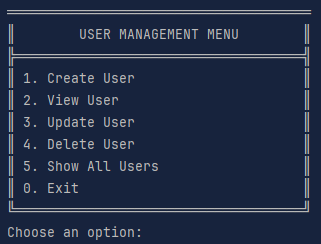

# User Management System (Python CLI CRUD) 


A simple command-line application written in Python that allows you to manage user accounts using basic CRUD operations. All user data is saved persistently in a JSON file.

## 📌 Features

- ✅ Create new users
- 📄 View user details
- ✏️ Update existing users
- ❌ Delete users
- 📋 List all users
- 💾 Data saved to `data.json`

## 📦 Requirements

- Python 3.x
- No external libraries (only standard library: `json`, `re`, etc.)

## ▶️ How to Run

```bash
python main.py
```

## 🧾 User Fields
Each user contains the following fields:
- username – must be unique and non-empty
- name – non-empty string
- email – must match standard format (e.g., example@domain.com)
- phone – international format (e.g., +1234567890)
- age – integer between 1 and 123


## 📚 Educational Context
This project fulfills the requirements of a Python programming assignment focused on:
- Object-oriented programming (OOP)
- Input validation using regular expressions and logic
- Persistent data storage using JSON
- Building a complete CRUD system in the command line
